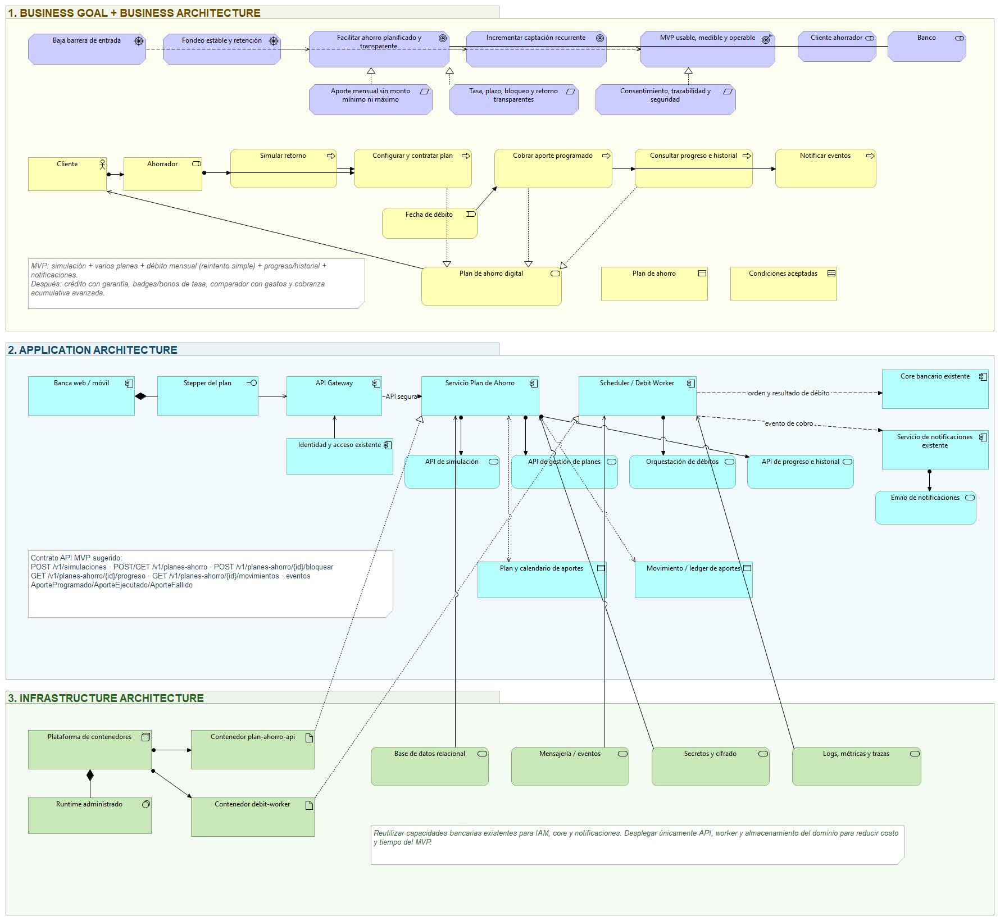

### API de planes de ahorro bancario

## 1. Introducción

### 1.1 Contexto del proyecto

El presente proyecto plantea el desarrollo de una API de planes de ahorro como una nueva funcionalidad de un sistema bancario existente. Por lo tanto, no contempla la construcción de un Core bancario desde cero, sino la incorporación de un componente especializado que utilizará las capacidades que ya forman parte del banco.

La API estará orientada a la gestión de planes de ahorro y operará dentro del ecosistema tecnológico de la institución. Esta funcionalidad permitirá organizar metas, programar aportes y mantener un seguimiento continuo desde los canales digitales utilizados por el cliente para administrar sus productos bancarios.

### 1.2 Propósito del documento

El propósito de este documento es presentar la visión de la API de planes de ahorro bancario y establecer su relación con las necesidades del cliente y los objetivos del banco. También se delimitan su alcance, los participantes involucrados, la cadena de valor y el modelo de monetización indirecta asociado con la captación y permanencia de fondos.

Además, se describen los objetivos, la anatomía y la naturaleza de la API, con el fin de establecer una base para las fases posteriores de arquitectura, diseño del contrato e implementación.

### 1.3 Relación con el ecosistema bancario

La API se integrará con capacidades existentes del banco, principalmente el Core bancario, el servicio de identidad y el servicio de notificaciones. Su responsabilidad se concentrará en la simulación, creación, configuración y seguimiento de los planes de ahorro, mientras que el Core continuará administrando las cuentas, los saldos, los movimientos y la ejecución de los débitos.

Esta separación permitirá utilizar los servicios disponibles sin duplicar funciones ni trasladar a la nueva API responsabilidades propias de los sistemas centrales. La API coordinará las interacciones necesarias y mantendrá límites definidos respecto de los procesos bancarios existentes.

## 2. Visión del producto

### 2.1 Problema identificado

Muchas personas desean ahorrar, pero no siempre establecen una meta concreta ni definen un plan para alcanzarla. Con frecuencia, el ahorro se limita al dinero restante al final del mes, sin una cuota programada ni un plazo determinado. Esta situación dificulta mantener la constancia y conocer cuánto se necesita aportar para alcanzar un objetivo.

También existe poca claridad sobre el resultado del ahorro. Sin una simulación previa, el cliente no conoce con precisión cuánto podría acumular al finalizar el periodo ni qué rendimiento generaría el dinero aportado. A esto se suma la falta de seguimiento cuando los fondos permanecen en la cuenta principal sin estar relacionados con una meta específica.

Estas condiciones dificultan la formación de un hábito de ahorro. La ausencia de aportes automáticos, una proyección visible y un registro del progreso aumenta la posibilidad de utilizar los fondos antes de alcanzar el objetivo.

### 2.2 Oportunidad para el banco

La incorporación de planes de ahorro permite ampliar los servicios disponibles en los canales digitales y captar depósitos recurrentes. Al ofrecer una simulación pública, un proceso de creación digital y aportes automáticos, el banco puede reducir las barreras para iniciar un plan y disminuir la necesidad de intervención en una agencia.

La permanencia de los fondos, especialmente en los planes bloqueados, proporciona un fondeo más estable para la actividad de intermediación financiera. Estos recursos pueden utilizarse en la colocación de créditos, mediante los cuales se generan ingresos por la diferencia entre la tasa pagada por los depósitos y la tasa cobrada por los préstamos.

La funcionalidad también permite medir la conversión entre las simulaciones realizadas y los planes creados. Esta información facilita la evaluación del proceso digital y del nivel de aceptación del producto.

### 2.3 Usuarios objetivo y necesidades

La funcionalidad estará dirigida principalmente a clientes que ya disponen de una cuenta bancaria y utilizan los canales digitales de la institución. Se consideran personas que desean comenzar con aportes pequeños, mantener uno o varios objetivos y automatizar el ahorro sin acudir a una agencia.

Las necesidades identificadas son:

- Definir uno o varios objetivos de ahorro.
- Conocer cuánto se debe aportar para alcanzar una meta.
- Establecer un plazo y una fecha mensual de débito.
- Consultar el monto y los intereses proyectados.
- Iniciar un plan sin restricciones de monto mínimo o máximo.
- Automatizar los aportes desde una cuenta bancaria.
- Separar el ahorro destinado a cada objetivo.
- Consultar el progreso y los movimientos de cada plan.
- Recibir información sobre los débitos y los eventos del plan.
- Bloquear el ahorro para acceder a una mejor tasa.
- Cancelar el plan y recuperar los fondos cuando sea necesario.

### 2.4 Visión y propuesta del producto

La API de planes de ahorro permitirá incorporar en los canales digitales del banco una funcionalidad para simular, crear y administrar diferentes objetivos de ahorro. Antes de crear un plan, el usuario podrá realizar una simulación pública y anónima para conocer el monto proyectado y los intereses correspondientes.

Después de seleccionar una alternativa, el cliente podrá crear uno o varios planes, definir el monto objetivo y el plazo, establecer una cuota fija mensual y elegir la fecha del débito. Durante la vigencia del plan podrá consultar su avance, revisar los movimientos y recibir notificaciones relacionadas con los aportes y los cambios de estado.

La propuesta incluye una modalidad de ahorro bloqueado con una tasa mayor. También permite cancelar el plan y devolver los fondos a la cuenta principal; si el ahorro se encontraba bloqueado, se perderán los intereses devengados. La gestión del plan corresponderá a la nueva funcionalidad, mientras que las cuentas y la ejecución de los débitos continuarán bajo la responsabilidad de los sistemas bancarios existentes.

### 2.5 Funcionalidades y alcance

La API administrará las siguientes funciones:

- Simular de forma pública y anónima el rendimiento proyectado del ahorro.
- Crear uno o varios planes con nombre, monto objetivo y plazo.
- Permitir planes sin monto mínimo ni máximo.
- Configurar una cuota fija mensual.
- Elegir y modificar la fecha mensual del débito.
- Bloquear un plan a plazo para obtener una mejor tasa.
- Programar los débitos automáticos desde una cuenta seleccionada.
- Realizar hasta cinco intentos de cobro, separados por periodos de 24 horas.
- Cancelar la cuota cuando los cinco intentos fallen y extender el plazo del plan un mes.
- Generar un cargo independiente por cada plan.
- Consultar y filtrar los planes activos, completados y cancelados.
- Consultar los movimientos asociados con cada plan.
- Mostrar el avance de la meta mediante una barra y un porcentaje de cumplimiento.
- Generar eventos de notificación sobre los débitos y los cambios del plan.
- Cancelar un plan y devolver los fondos a la cuenta principal.
- Aplicar la pérdida de los intereses devengados cuando se cancele un plan bloqueado.
- Conservar un historial inmutable de movimientos que permita reconstruir el saldo de cada plan.

La nueva funcionalidad utilizará capacidades existentes del banco para:

- Identificar y autenticar al cliente.
- Consultar las cuentas habilitadas.
- Ejecutar los débitos y confirmar su resultado.
- Devolver los fondos a la cuenta principal cuando se cancele o complete un plan.
- Enviar notificaciones mediante los canales institucionales.

Esta delimitación permite incorporar la Billetera de Ahorro sin duplicar las funciones del Core bancario. La API administrará el ciclo de vida de los planes y su historial, mientras que el Core continuará gestionando las cuentas y la ejecución de las operaciones financieras.

## 3. Objetivos y resultados esperados

### 3.1 Objetivo general

Desarrollar una API integrada al sistema bancario que permita simular, crear y administrar planes de ahorro, con el fin de facilitar el cumplimiento de los objetivos financieros de los clientes y aumentar la captación y permanencia de fondos en la institución.

### Objetivos específicos

- Permitir la simulación pública y anónima del rendimiento proyectado de un plan de ahorro.
- Facilitar la creación y administración de varios planes por cliente, sin establecer montos mínimos ni máximos.
- Permitir la configuración de una cuota fija mensual y la selección o modificación de la fecha del débito.
- Automatizar los aportes mediante débitos programados desde una cuenta bancaria y aplicar la política de reintentos definida.
- Facilitar el seguimiento mediante la consulta del progreso, el porcentaje de cumplimiento y el historial de movimientos de cada plan.
- Permitir el bloqueo del ahorro a plazo para acceder a una mejor tasa de interés.
- Permitir la cancelación del plan y la devolución de los fondos a la cuenta principal, con la pérdida de los intereses devengados cuando el plan se encuentre bloqueado.
- Mantener un historial inmutable de movimientos que permita reconstruir y auditar el saldo de cada plan.
- Integrar la nueva funcionalidad con el Core bancario, el servicio de identidad y el servicio de notificaciones, sin duplicar las responsabilidades de estos sistemas.

### 3.3 Indicadores de éxito

Los resultados de la funcionalidad se evaluarán mediante indicadores de negocio, producto, operación y desempeño de la API.

| Indicador                        | Descripción                                                                                         |
|--------------------------------------|---------------------------------------------------------------------------------------------------------|
| Saldo bajo gestión                   | Porcentaje de simulaciones que finalizan con la creación de un plan.                                    |
| Aportes recurrentes por mes          | Cantidad de aportes procesados durante cada mes.                                                        |
| Planes bloqueados                    | Porcentaje de planes activos que utilizan la modalidad de ahorro bloqueado.                             |
| Cuotas canceladas                    | Porcentaje de cuotas canceladas después de cinco intentos fallidos por falta de fondos.                 |
| Conversión de simulaciones en planes | Porcentaje de simulaciones que finalizan con la creación de un plan.                                    |
| Planes activos por cliente           | Cantidad promedio de planes activos asociados con cada cliente.                                         |
| Cobros exitosos al primer intento    | Porcentaje de débitos completados en el primer intento de cobro.                                        |
| Corridas de cobro completadas        | Porcentaje de procesos de cobro ejecutados completamente sin necesidad de reinicio.                     |
| Latencia p95                         | Percentil 95 de respuesta en los endpoints síncronos, con un objetivo inferior a 500 ms.                |
| Tasa de error                        | Porcentaje de solicitudes fallidas, con un objetivo inferior al 1 % durante la carga sostenida.         |
| Rendimiento                          | Cantidad de peticiones procesadas por segundo bajo carga.                                               |
| Punto de ruptura                     | Nivel de usuarios concurrentes o peticiones por segundo a partir del cual la API comienza a degradarse. |

Tabla 1. Indicadores de éxito del sistema

## 4. Cadena de valor de la API

La cadena de valor describe el proceso mediante el cual una intención de ahorro se transforma en un plan activo con aportes programados y seguimiento continuo. La API conecta los canales digitales con el Core bancario, el servicio de identidad, el proceso de cobros y el servicio de notificaciones, sin duplicar sus responsabilidades.

### 4.1 Participantes de la cadena

| Participante               | Participación                                                                                                  |
|--------------------------------|--------------------------------------------------------------------------------------------------------------------|
| Usuario interesado             | Realiza una simulación pública y anónima antes de crear un plan                                                    |
| Cliente ahorrador              | Crea uno o varios planes, configura la cuota y la fecha del débito, consulta el progreso y puede cancelar el plan. |
| Banca web o móvil              | Presenta la funcionalidad y permite la interacción con los planes de ahorro.                                       |
| API de planes de ahorro        | Administra la simulación, creación, configuración, estado y seguimiento de los planes.                             |
| Proceso de cobros              | Programa las cuotas mensuales, controla los reintentos y registra el resultado de cada corrida                     |
| Core bancario                  | Proporciona las cuentas, ejecuta los débitos y confirma el resultado de las operaciones.                           |
| Servicio de identidad y acceso | Autentica al cliente y controla los permisos de acceso a los recursos.                                             |
| Servicio de notificaciones     | Envía avisos sobre débitos ejecutados, intentos fallidos, cambios y eventos del plan.                              |
| Operador del banco             | Consulta el estado de los cobros y atiende reclamos relacionados con los aportes.                                  |
| Auditor financiero             | Consulta el historial inmutable para verificar los movimientos y reconstruir el saldo de cada plan.                |

Tabla 2. Participantes del sistema

### 4.2 Etapas de la cadena

La cadena comienza con una simulación pública y anónima. El usuario establece las condiciones del ahorro y consulta el monto acumulado y los intereses proyectados antes de asumir un compromiso. Si decide continuar, se autentica en la aplicación bancaria y crea el plan. Durante este proceso define el nombre, el monto objetivo, el plazo, la cuota fija mensual, la fecha del débito y la modalidad de ahorro. El plan puede mantenerse disponible o bloquearse a plazo para obtener una mejor tasa.

Una vez activo, el proceso de cobros solicita mensualmente el débito al Core bancario. Si el primer intento falla, se realizan nuevos intentos cada 24 horas hasta completar un máximo de cinco. Cuando ninguno tiene éxito, la cuota se cancela y el plazo del plan se extiende un mes. No se genera mora, no se acumula deuda y no se cobran dos cuotas juntas.

Durante la vigencia del plan, el cliente consulta los movimientos, la barra de progreso y el porcentaje de cumplimiento. El historial inmutable permite reconstruir el saldo, mientras que las notificaciones informan los resultados de los débitos y los cambios del plan. El proceso concluye cuando el saldo alcanza el monto objetivo y los fondos se liquidan al cliente. También puede finalizar por cancelación anticipada, caso en el que los fondos regresan a la cuenta principal. Si el plan se encontraba bloqueado, se pierden los intereses devengados.

La secuencia se resume de la siguiente manera:

Simulación pública → Creación y configuración → Programación del débito → Cobro y reintentos → Seguimiento del progreso → Cumplimiento o cancelación

### 4.3 Resultado de cada etapa

| Etapa                | Resultado para el cliente                                                      | Resultado para el banco                                                            |
|--------------------------|------------------------------------------------------------------------------------|----------------------------------------------------------------------------------------|
| Simulación pública       | Conoce el monto y los intereses proyectados antes de registrarse.                  | Reduce la barrera de entrada y mide la conversión entre simulaciones y planes creados. |
| Creación y configuración | Formaliza la meta, la cuota, el plazo y la fecha del débito.                       | Convierte una intención de ahorro en captación recurrente.                             |
| Programación del débito  | Automatiza el aporte mensual desde una cuenta seleccionada.                        | Establece un flujo periódico de depósitos.                                             |
| Cobro y reintentos       | Cuenta con una política predecible que no genera mora ni acumula cuotas.           | Recupera cobros fallidos mediante reintentos controlados.                              |
| Seguimiento del progreso | Consulta los movimientos, el saldo y el porcentaje de cumplimiento.                | Favorece la constancia y la permanencia de los fondos.                                 |
| Cumplimiento del plan    | Recibe los fondos cuando alcanza el monto objetivo.                                | Completa el ciclo del producto y fortalece la relación con el cliente.                 |
| Cancelación anticipada   | Recupera los fondos; si el plan estaba bloqueado, pierde los intereses devengados. | Mantiene una regla de salida clara y conserva la trazabilidad de la operación.         |

Tabla 3. Resultados esperados por etapa.

### 4.4 Niveles de valor de la API

| Nivel                | Aplicación en el producto                                                                              | Estado    |
|--------------------------|------------------------------------------------------------------------------------------------------------|---------------|
| Conectividad de sistemas | Integra el Core bancario, identidad, cobros y notificaciones.                                              | MVP           |
| Habilitación omnicanal   | El mismo contrato puede ser consumido por la banca web y móvil sin duplicar la lógica.                     | MVP           |
| Socios y monetización    | Un comercio o una fintech podrá ofrecer ahorro embebido mediante la API.                                   | Fase 2        |
| Diferenciación           | El historial de cumplimiento podrá utilizarse como insumo para un modelo interno de evaluación crediticia. | Visión futura |

Tabla 4. Niveles de valor de la API

En el MVP, el valor principal de la API se encuentra en la integración de capacidades existentes y en la habilitación de un mismo producto para distintos canales digitales. La apertura a socios y el uso del historial para evaluación crediticia permanecen fuera del alcance actual.

## 5. Modelo de negocio y monetización

La API de planes de ahorro funcionará como una capacidad interna del banco y será consumida principalmente desde la banca web y móvil. Su monetización no se basará en el cobro por llamadas, suscripciones o comisiones al ahorrador, sino en los resultados financieros generados por la captación y permanencia de los depósitos.

### Modelo de negocio

El modelo se orienta a clientes que desean organizar uno o varios objetivos de ahorro mediante los canales digitales del banco. La funcionalidad permitirá realizar una simulación antes de registrarse, crear planes sin monto mínimo ni máximo, programar aportes mensuales y bloquear los fondos a plazo para obtener una mejor tasa.

| Elemento            | Descripción                                                                                                                                |
|-------------------------|------------------------------------------------------------------------------------------------------------------------------------------------|
| Segmento de clientes    | Clientes de la aplicación bancaria, especialmente personas que desean iniciar con aportes pequeños o administrar varios objetivos.             |
| Canal                   | Aplicación bancaria web o móvil.                                                                                                               |
| Producto                | Planes de ahorro con simulación, aportes automáticos, seguimiento y acceso a condiciones relacionadas con el monto acumulado                   |
| Actividades principales | Administración de planes, coordinación de aportes, seguimiento e integración con los servicios bancarios.                                      |
| Sistemas participantes  | Core bancario, identidad y acceso, crédito, notificaciones y analítica                                                                         |
| Lógica económica        | Captación y permanencia de fondos que pueden destinarse a la colocación de créditos y a la contratación de productos financieros relacionados. |

Tabla 5. Elementos del modelo de negocio

### 5.2 Mecanismos de monetización

El modelo utiliza tres mecanismos económicos dentro del alcance actual.

El primero es el spread de intermediación. El banco paga una tasa pasiva por los depósitos recibidos y puede colocar esos recursos mediante créditos a una tasa activa. La diferencia entre ambas tasas representa el margen financiero generado por el saldo captado y el tiempo durante el cual permanece en la institución.

El segundo es la calidad del fondeo. Los planes bloqueados mantienen los fondos durante un periodo definido y proporcionan mayor estabilidad que los depósitos disponibles para retiro inmediato. Esta permanencia permite al banco disponer de recursos con mayor previsibilidad y justifica el pago de una mejor tasa al cliente.

El tercero es la reducción del costo de adquisición. La simulación y creación digital del plan disminuyen la necesidad de atención en una agencia. Esta reducción no constituye un ingreso directo, pero libera margen al disminuir el costo asociado con la apertura y administración del producto.

En una fase futura, la API podría habilitar un canal de socios para ofrecer ahorro integrado desde comercios o empresas de tecnología financiera. Este escenario permitiría establecer acuerdos B2B basados en participación de ingresos o tarifas por volumen, pero no forma parte del MVP.

La API no se monetizará mediante pay-per-call, suscripciones, límites de planes, comisiones al ahorrador ni venta de datos. El modelo seleccionado es principalmente indirecto y depende del volumen de depósitos, su recurrencia y su permanencia.

### 5.3 Costos principales

Los costos corresponden al desarrollo y mantenimiento de la API, la integración con los sistemas existentes, la infraestructura de ejecución, el almacenamiento del historial de movimientos y el soporte operativo. También se consideran la seguridad, el monitoreo, las notificaciones y las pruebas necesarias para mantener el servicio.

Debido a que el margen depende del volumen y la permanencia de los depósitos, el costo de operación debe mantenerse controlado. Un costo elevado por cada plan reduciría el margen financiero obtenido, especialmente en los planes con cuotas pequeñas.

## 6. Naturaleza y límites de la API

La API de planes de ahorro constituye una capacidad de negocio integrada al ecosistema tecnológico del banco. Su función es exponer y coordinar las operaciones relacionadas con los planes de ahorro, manteniendo separados este dominio y las responsabilidades propias de los sistemas bancarios existentes.

### 6.1 Clasificación

La API se clasifica de la siguiente manera:

- API de negocio, porque expone las capacidades relacionadas con la simulación, creación y administración de planes de ahorro.
- Principalmente interna, porque sus operaciones serán consumidas por la banca web, la aplicación móvil y otros sistemas autorizados del banco.
- Pública de forma limitada, porque la simulación y la consulta de tarifas podrán utilizarse sin autenticación.
- Integrada, porque depende del Core bancario, el servicio de identidad y el servicio de notificaciones.
- Orientada al dominio, porque concentra las reglas y los datos correspondientes a los planes de ahorro.

La apertura a comercios o empresas de tecnología financiera se contempla para una fase posterior y no forma parte del MVP.

### 6.2 Consumidores

Los consumidores definidos para el alcance actual son:

- Banca web.
- Aplicación móvil.
- Usuarios anónimos que acceden a la simulación y consulta de tarifas.
- Sistemas internos autorizados.
- Operadores y auditores con permisos específicos.

En una fase futura podrán incorporarse socios externos mediante contratos y permisos restringidos.

### 6.3 Responsabilidades de la API

La API y los componentes propios del dominio serán responsables de:

- Simular el rendimiento proyectado del ahorro.
- Crear y administrar uno o varios planes por cliente.
- Configurar el monto objetivo, el plazo y la cuota fija mensual.
- Elegir y modificar la fecha mensual del débito.
- Administrar la modalidad de ahorro bloqueado y la tasa correspondiente.
- Programar los cobros y controlar la política de cinco intentos.
- Cancelar una cuota fallida y extender el plazo del plan un mes.
- Consultar y filtrar los planes activos, completados y cancelados.
- Consultar los movimientos de cada plan.
- Calcular y mostrar la barra de progreso y el porcentaje de cumplimiento.
- Cancelar el plan y solicitar la devolución de los fondos.
- Aplicar la pérdida de intereses cuando se cancele un plan bloqueado.
- Generar eventos relacionados con débitos y cambios del plan.
- Mantener un historial inmutable que permita reconstruir y auditar el saldo.

La API no ejecutará directamente las operaciones contables sobre las cuentas bancarias. El proceso de cobros solicitará las operaciones al Core y registrará los resultados recibidos.

### 6.4 Responsabilidades de los sistemas existentes

Las capacidades existentes del banco conservarán las siguientes responsabilidades:

| Sistema                    | Responsabilidad                                                                                              |
|--------------------------------|------------------------------------------------------------------------------------------------------------------|
| Banca web y móvil              | Presentar la interfaz y permitir la interacción del cliente con la funcionalidad.                                |
| API Gateway                    | Enrutar las solicitudes y aplicar las políticas generales de acceso y protección.                                |
| Servicio de identidad y acceso | Autenticar al cliente, emitir los tokens y proporcionar la información necesaria para autorizar las operaciones. |
| Core bancario                  | Consultar cuentas, ejecutar débitos, devolver fondos y confirmar el resultado de las operaciones financieras.    |
| Servicio de notificaciones     | Entregar los avisos generados por los eventos de la Billetera de Ahorro.                                         |

Tabla 6. Responsabilidades de los sistemas participantes

Esta separación evita duplicar las capacidades existentes y limita la nueva solución al dominio de los planes de ahorro.

### 6.5 Cinco dimensiones del diseño

| Dimensión     | Aplicación en la API                                                                                                                                                                    |
|-------------------|---------------------------------------------------------------------------------------------------------------------------------------------------------------------------------------------|
| Interoperabilidad | Las capacidades se exponen mediante un contrato REST que puede ser consumido por la banca web, la aplicación móvil y, en una fase futura, por socios externos.                              |
| Modularidad       | La interfaz, la API, el proceso de cobros y el Core bancario mantienen responsabilidades separadas. El contrato OpenAPI permite que Frontend y Backend evolucionen de manera independiente. |
| Escalabilidad     | La API y el proceso de cobros podrán escalar horizontalmente para atender el crecimiento de usuarios, planes y débitos programados.                                                         |
| Estandarización   | Se utilizarán REST, OpenAPI 3.1, JSON, OAuth 2.0 y formatos estandarizados para fechas, montos y errores.                                                                                   |
| Seguridad         | El acceso utilizará OAuth 2.0 y tokens JWT de corta duración. También se aplicarán permisos por rol, validación de titularidad, cifrado y auditoría inmutable de los movimientos.           |

Tabla 7. Dimensiones de la API

Estas dimensiones establecen los principios generales del diseño. La selección detallada del estilo arquitectónico, los patrones y la infraestructura corresponde a la fase de arquitectura.

## 7. Representación ArchiMate

La representación ArchiMate permite visualizar la relación entre las necesidades del negocio, el servicio de planes de ahorro, los componentes de aplicación y la infraestructura que respalda su funcionamiento. Para este proyecto se utiliza una vista integrada organizada en tres grupos: arquitectura de negocio, arquitectura de aplicaciones y arquitectura de infraestructura.

El modelo complementa la descripción realizada en las secciones anteriores y permite identificar cómo los objetivos del banco se relacionan con los procesos y componentes tecnológicos de la solución. No sustituye el modelo de negocio ni la definición funcional de la API.

### 7.1 Vista de motivación y negocio

La vista de motivación identifica al cliente ahorrador y al banco como las partes interesadas principales. Las necesidades del cliente se relacionan con la planificación transparente del ahorro, mientras que el banco busca incrementar la captación recurrente y mantener los fondos durante periodos definidos.

Los principales elementos de motivación representados son:

- Impulsores: baja barrera de entrada para comenzar a ahorrar y necesidad de contar con fondos estables.
- Objetivos: facilitar el ahorro planificado y transparente e incrementar la captación recurrente.
- Resultado esperado: disponer de un producto mínimo viable que pueda utilizarse, medirse y operarse dentro del ecosistema bancario.
- Requisitos: permitir aportes sin un monto mínimo o máximo propio, informar las condiciones de tasa, plazo, bloqueo y retorno, y mantener consentimiento, seguridad y trazabilidad.

En la capa de negocio, el cliente desempeña el rol de ahorrador y utiliza el servicio de planes de ahorro digital. Este servicio comprende los procesos de simulación, configuración y creación del plan, cobro de aportes programados, consulta del progreso e historial, notificación de eventos y cancelación del plan.

El objeto central del negocio es el plan de ahorro, cuyas condiciones deben ser aceptadas por el cliente. La fecha de débito funciona como el evento que inicia periódicamente el proceso de cobro del aporte programado.

### 7.2 Vista de aplicaciones e integraciones

La vista de aplicaciones muestra los componentes que participan en la prestación del servicio. El cliente accede mediante la aplicación bancaria web o móvil y utiliza un proceso guiado para simular y configurar el plan.

Las solicitudes son recibidas por el API Gateway, que controla el acceso y dirige las operaciones hacia el servicio de planes de ahorro. La simulación podrá ejecutarse sin autenticación, bajo las restricciones correspondientes, mientras que la creación y administración de planes requerirán la validación del cliente mediante el servicio institucional de identidad y acceso.

El servicio de planes de ahorro administra la lógica correspondiente a:

- Simulación del ahorro.
- Creación y configuración de planes.
- Administración del bloqueo.
- Seguimiento del progreso.
- Consulta del historial.
- Coordinación de los aportes programados.
- Cancelación de planes.
- Generación de eventos de notificación.

El trabajador de débitos ejecuta las tareas programadas y solicita al Core bancario el cobro de cada aporte. Cuando un débito no puede completarse, se aplicará la política de hasta cinco intentos, separados por periodos de 24 horas. Si el quinto intento falla, la cuota se cancela y el plazo del plan se extiende un mes, sin generar deuda acumulada.

El Core bancario mantiene la responsabilidad sobre las cuentas, los saldos, los movimientos contables, los débitos y el bloqueo efectivo de los fondos. El servicio institucional de notificaciones entrega los avisos generados por los eventos del plan.

La información propia del dominio se organiza en los registros del plan, el calendario de aportes y el historial inmutable de movimientos. Esta separación permite que la API administre el ciclo de vida del plan sin asumir las responsabilidades financieras y contables del Core bancario.

### 7.3 Vista de infraestructura

La vista de infraestructura presenta los recursos necesarios para ejecutar los componentes de la nueva funcionalidad. La API y el trabajador de débitos se desplegarán en una plataforma de ejecución basada en contenedores.

La solución utilizará una base de datos relacional para almacenar los planes, calendarios de aportes y movimientos. También contará con mecanismos de mensajería o eventos para coordinar procesos como las notificaciones, además de servicios de gestión de secretos, cifrado, registros, métricas y trazas.

La infraestructura reutilizará los servicios existentes de identidad, Core bancario y notificaciones. Por tanto, el nuevo despliegue se concentrará en la API, el trabajador de débitos y el almacenamiento correspondiente al dominio de planes de ahorro.

Ilustración 1. Vista ArchiMate integrada de la API de planes de ahorro bancario

## 8. Riesgos, supuestos y restricciones

La implementación de la API depende de condiciones operativas y capacidades existentes dentro del ecosistema bancario. La siguiente tabla presenta los principales supuestos, dependencias, riesgos y restricciones considerados para el alcance del producto.

| Tipo    | Descripción                                                                                                                                                                                                    |
|-------------|--------------------------------------------------------------------------------------------------------------------------------------------------------------------------------------------------------------------|
| Supuesto    | El cliente dispone de una cuenta bancaria activa y habilitada para crear un plan y realizar los aportes programados. Este requisito no aplica a la simulación pública y anónima.                                   |
| Supuesto    | El Core bancario ofrece interfaces para consultar cuentas, ejecutar débitos, bloquear fondos y devolver el dinero cuando un plan sea cancelado o completado.                                                       |
| Supuesto    | Las tasas y condiciones utilizadas por la simulación son proporcionadas y actualizadas por el banco.                                                                                                               |
| Dependencia | La operación de los planes depende de la disponibilidad del Core bancario y del servicio institucional de identidad y acceso.                                                                                      |
| Dependencia | La entrega de avisos depende del servicio institucional de notificaciones, aunque una falla en este servicio no debe impedir el registro de las operaciones del plan.                                              |
| Riesgo      | Los débitos fallidos pueden extender repetidamente el plazo del plan y alejar la fecha estimada para alcanzar la meta.                                                                                             |
| Riesgo      | Una cuota definida por encima de la capacidad de ahorro del cliente puede provocar fallos recurrentes y afectar la continuidad del plan.                                                                           |
| Riesgo      | Una simulación basada en tasas o reglas desactualizadas puede generar expectativas incorrectas sobre el monto y los intereses proyectados.                                                                         |
| Riesgo      | La ausencia de un aporte mínimo puede ocasionar que el costo de procesar determinadas cuotas sea superior al beneficio económico obtenido por el banco.                                                            |
| Riesgo      | Una interrupción o respuesta incierta del Core durante un débito puede producir inconsistencias o cobros duplicados si la operación no se controla adecuadamente.                                                  |
| Restricción | La API no accede directamente a la base de datos del Core ni ejecuta movimientos contables por cuenta propia; estas operaciones se solicitan mediante las interfaces autorizadas.                                  |
| Restricción | Los débitos fallidos se reintentan cada 24 horas hasta un máximo de cinco intentos. Si el último intento falla, la cuota se cancela y el plazo se extiende un mes, sin acumular deuda ni cobrar dos cuotas juntas. |
| Restricción | La cancelación de un plan bloqueado implica la pérdida de los intereses generados, mientras que los fondos aportados se devuelven a la cuenta principal.                                                           |
| Restricción | Las operaciones financieras deben mantener seguridad, consistencia, trazabilidad y protección contra el procesamiento duplicado.                                                                                   |
| Restricción | Los movimientos financieros deben conservarse en un historial inmutable y no pueden eliminarse mediante operaciones de borrado.                                                                                    |

Tabla 8. Riesgos, supuestos y restricciones de la API

Estos elementos delimitan las condiciones bajo las cuales funcionará la API y permiten identificar aspectos que deberán controlarse durante el diseño, la implementación y la operación del producto.

## 9. Conclusiones

La API de planes de ahorro responde a la dificultad de establecer objetivos financieros, calcular los aportes necesarios y mantener un seguimiento constante. La simulación, la programación autónoma de aportes y la consulta del progreso permiten organizar el ahorro dentro de los canales digitales que el cliente ya utiliza.

La viabilidad del producto se sustenta en su integración con las capacidades existentes del banco. La nueva solución administra el dominio de los planes de ahorro, mientras que el Core y los servicios institucionales conservan la responsabilidad sobre las cuentas, la autentificación, los movimientos contables, el bloqueo de fondos y las notificaciones. Esta distribución evita reconstruir funciones existentes y delimita las responsabilidades de cada componente.

Para el banco, el producto permite incrementar la captación recurrente y favorece la permanencia de los fondos. Su monetización es principalmente indirecta, debido a que no se cobra por consumir la API. EL benéfico económico se obtiene mediante la disponibilidad de fondos para la intermediación financiera y, de forma complementaria, por la contratación de productos relacionados.

La implementación mediante una API permite separar la lógica de los planes de ahorro del Core bancario y exponerla de forma controlada a la aplicación web, móvil y otros sistemas internos autorizados. Además facilita la integración, evolución y escalabilidad de la funcionalidad sin trasladar a la nueva solución las responsabilidades centrales de la institución.

## 10. Referencias

- Universidad Politécnica Salesiana. (2026). *Unidad 1: Introducción a las APIs*. Material académico de la asignatura Arquitectura de APIs.
- The Open Group. (2022). *ArchiMate 3.2 Specification*. The Open Group.
- OpenAPI Initiative. (s. f.). *OpenAPI Specification, versión 3.1*.
- Hardt, D. (2012). *The OAuth 2.0 Authorization Framework*. RFC 6749. Internet Engineering Task Force.
- Equipo del proyecto. (2026). *Visión y negocio de la billetera de ahorro*. Documento interno.
- Equipo del proyecto. (2026). *Requerimientos de la billetera de ahorro*. Documento interno.
