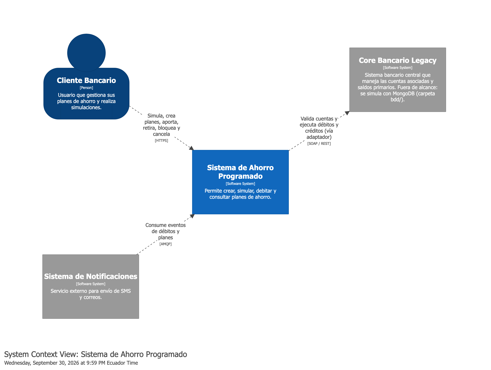
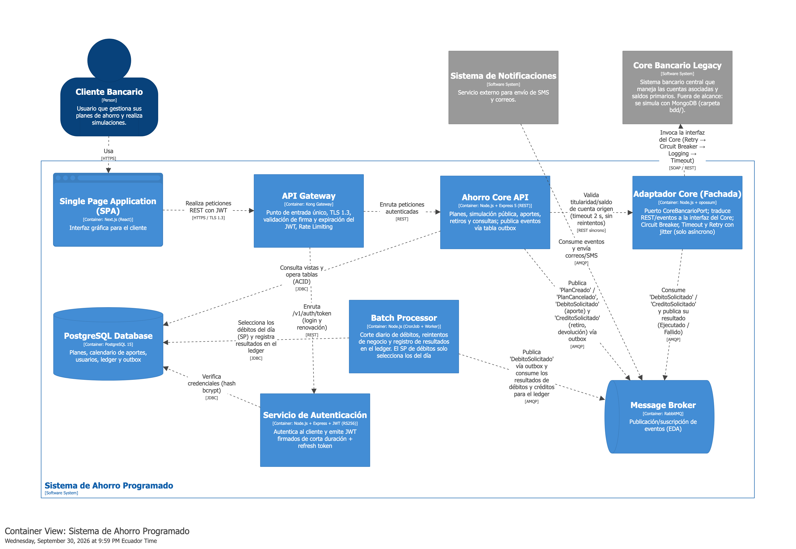

# API de planes de ahorro bancario

**Fase 2: Arquitectura y patrones de diseño (RA2)**

Universidad Politécnica Salesiana · Maestría en Software

Asignatura: Patrones de Diseño de APIs

Docente: Ing. Patsy Malena Prieto, MSc.

**Integrantes:**

1. Carlos Adrian Espinoza Alvarez
2. Pablo Jara
3. Miguel Lara
4. Carina Torres
5. Sebastián Uyaguari

Fecha: 5 de octubre de 2026

---

## 1. Introducción

### 1.1 Propósito del documento

En la Fase 1 justificamos el caso de negocio de la Billetera de Ahorro. En esta segunda fase definimos cómo se va a construir: elegimos el estilo arquitectónico, armamos los diagramas de la solución y justificamos los patrones de diseño que decidimos aplicar.

Para tomar las decisiones usamos las herramientas que revisamos en la Unidad 2 de la asignatura (Prieto, 2026): la matriz de calidad ISO/IEC 25010, el árbol de decisiones de interacción de datos, los tres pilares de patrones y la matriz de diagnóstico.

Los patrones se presentan en dos niveles. En el nivel de arquitectura (sección 4.1) están los patrones orientados a APIs que organizan los contenedores: API Gateway, Circuit Breaker, paginación, publicación/suscripción, entre otros. En el nivel de código (sección 4.5) están los patrones de diseño clásicos (Gamma et al., 1994) con los que cada contenedor implementa esas decisiones.

### 1.2 Requisitos que guían la arquitectura

Al revisar los requisitos de la Fase 1 notamos que no todos influyen igual en la arquitectura. La siguiente tabla recoge los que más pesaron en nuestras decisiones:

| Requisito | Descripción | Impacto en la arquitectura |
|---|---|---|
| RNF-01.1 | p95 menor a 500 ms en endpoints síncronos | Caché HTTP, paginación y pocas llamadas síncronas |
| RNF-01.2 | Procesamiento batch del corte de débitos | Batch Processor y uso de eventos para absorber el pico |
| RNF-02.1 | JWT de corta duración emitido por un servicio interno | Servicio de Autenticación y validación en el Gateway |
| RNF-02.3 | Consistencia ACID en los movimientos de saldo | Una sola base relacional para las escrituras y Transactional Outbox para publicar eventos |
| RNF-03.1 | Desacoplamiento del Core legacy vía EDA | Message Broker y Adaptador Core |
| RNF-03.2 | Disponibilidad de 99.9 % | Circuit Breaker y Retry con jitter |
| RNF-03.3 | Auditoría inmutable por transacción | Ledger de solo inserción |
| RF-01.4 y RF-01.5 | Historial de planes y de movimientos | Paginación por offset y por cursor, filtros |
| RF-02.1 | Simulación pública sin autenticación | Rate Limiting y caché |
| RF-03.1 | Débito automático con 5 intentos cada 24 h | Reintento de negocio a cargo del Batch, modelado con el patrón State |
| RF-04.2 y RF-01.7 | Penalidad al cancelar o desbloquear un plan bloqueado | Política de salida del bloqueo intercambiable (patrón Strategy) |
| RF-04.3 | Retiro parcial a una cuenta del cliente | Evento CreditoSolicitado, simétrico al débito |

*Tabla 1. Requisitos con impacto en la arquitectura*

## 2. Arquitectura de software

### 2.1 Capas de la arquitectura

Organizamos los componentes según las cuatro capas de una arquitectura orientada a APIs vistas en clase. En la capa de integración ubicamos todo lo que protege al dominio de lo externo: el Gateway frente a los clientes y el Adaptador frente al Core legacy.

| Capa | Componentes | Responsabilidad |
|---|---|---|
| Presentación | Banca web (SPA en Next.js) | Interfaz para simular, crear, consultar, aportar, retirar, bloquear, desbloquear y cancelar planes |
| Integración | API Gateway (Kong), Adaptador Core y Message Broker (RabbitMQ) | Punto de entrada, seguridad perimetral, traducción hacia el legacy y mensajería asíncrona |
| Aplicación | Ahorro Core API, Servicio de Autenticación y Batch Processor | Reglas de negocio de los planes, emisión de tokens y corte de débitos |
| Acceso a datos | PostgreSQL 15 | Planes, calendario de aportes, usuarios, ledger y tabla outbox, con transacciones ACID |

*Tabla 2. Capas y componentes de la solución*

### 2.2 Diagrama de contexto

Modelamos la arquitectura con el enfoque C4 en Structurizr DSL (archivo docs/diagramas/workspace.dsl). A nivel de contexto el sistema solo depende de dos sistemas que el banco ya tiene: el Core bancario, que sigue siendo el responsable de las cuentas y de las operaciones contables, y el sistema de notificaciones.

Ambos sistemas quedan fuera del alcance del proyecto. Para poder ejecutar el flujo completo, el Core bancario se simula con una base MongoDB Atlas (modelo de la carpeta bdd/) que reproduce clientes, cuentas y saldos como lo haría un core de producción. La Billetera de Ahorro no accede a esa base directamente: toda interacción pasa por el Adaptador Core, igual que ocurriría con el Core real.



*Ilustración 1. Diagrama de contexto (C4, nivel 1)*

### 2.3 Diagrama de contenedores

Decidimos desplegar la solución como un monolito modular y no como microservicios. Todo el backend es un solo proyecto en Node.js (TypeScript) organizado en capas (dominio, aplicación, infraestructura y presentación), con un punto de entrada por proceso. En la infografía de rediseño vista en clase, esta opción aparece como la adecuada para equipos pequeños y dominios simples, y ese es nuestro caso: tenemos un solo dominio (los planes de ahorro) y un equipo de cinco personas. Separamos en contenedores propios únicamente el Batch Processor, el Adaptador Core y el Servicio de Autenticación, porque tienen un ciclo de ejecución o requisitos de seguridad distintos a los de la API.

La Ahorro Core API y el Batch Processor no publican directamente en RabbitMQ: guardan el evento en una tabla outbox dentro de la misma transacción que la operación que lo origina, y un publicador lo envía al broker después del commit (sección 4.1).



*Ilustración 2. Diagrama de contenedores (C4, nivel 2)*

| Contenedor | Tecnología | Responsabilidad |
|---|---|---|
| SPA | Next.js (React) | Interfaz del cliente |
| API Gateway | Kong Gateway | Punto de entrada único, TLS 1.3, validación de firma y expiración del JWT, Rate Limiting |
| Servicio de Autenticación | Node.js + Express + JWT (RS256) | Verifica credenciales y emite el access token y el refresh token |
| Ahorro Core API | Node.js + Express 5 (REST) | Planes, simulación pública, aportes bajo solicitud y consultas; publica eventos mediante la tabla outbox |
| Batch Processor | Node.js (CronJob + Worker) | Corte diario de débitos automáticos, reintentos de negocio y registro en el ledger del resultado de todos los débitos |
| Adaptador Core | Node.js + opossum (Circuit Breaker) | Único punto de contacto con el Core legacy, detrás del puerto CoreBancarioPort |
| Message Broker | RabbitMQ | Publicación y suscripción de eventos |
| Base de datos | PostgreSQL 15 | Datos del dominio, ledger y tabla outbox |

*Tabla 3. Contenedores del sistema*

### 2.4 Vista ArchiMate

Actualizamos la vista ArchiMate de la Fase 1 para que coincida con los contenedores anteriores. En la capa de motivación agregamos un segundo requisito de débito, porque el producto maneja dos casos: el débito automático, que ejecuta el Batch Processor en la fecha programada, y el aporte que el cliente solicita desde la aplicación. Los dos terminan publicando el mismo evento DebitoSolicitado, así que comparten el camino hacia el Core, la resiliencia y la trazabilidad.


*Ilustración 3. Vista ArchiMate de la Fase 2*

## 3. Selección del estilo arquitectónico

### 3.1 Evaluación con ISO/IEC 25010

Como se vio en clase, no hay un estilo que sea mejor en todo: cada uno gana en unos atributos de calidad y pierde en otros. Por eso comparamos los cuatro estilos candidatos con la matriz de la Unidad 2 y agregamos una fila con nuestra valoración para este caso.

| Atributo | REST | GraphQL | gRPC | EDA |
|---|---|---|---|---|
| Facilidad de cacheo | Alto | Bajo | Bajo | N/A |
| Escalabilidad concurrente | Medio | Medio | Alto | Alto |
| Mantenibilidad | Alto | Medio | Medio | Bajo |
| Seguridad perimetral | Medio | Bajo | Alto | Medio |
| ¿Aplica a nuestro caso? | Sí. Cliente web, recursos simples y simulación que se puede cachear | No. No hay datos jerárquicos ni varios clientes, y se pierde el cacheo | No. El navegador no lo soporta de forma nativa y hay un solo servicio | Sí. Hay un pico diario de débitos y un Core legacy |

*Tabla 4. Comparación de estilos según ISO/IEC 25010*

### 3.2 Árbol de decisiones

Recorrimos el árbol de decisiones de la clase con las características del proyecto. La primera pregunta es si hay comunicación interna de alta densidad entre microservicios; en nuestro caso no, porque existe un solo servicio de dominio, así que gRPC no aporta. La segunda pregunta es si hay picos masivos que puedan saturar la base de datos, y aquí la respuesta es sí: el corte diario concentra miles de débitos en pocas horas, lo que nos llevó a desacoplar ese flujo con EDA. Por último, la interfaz no maneja datos jerárquicos complejos, ya que planes y movimientos son recursos planos, por lo que para el consumo del cliente nos quedamos con REST y OpenAPI.

### 3.3 Decisión

Con base en lo anterior, decidimos usar un estilo híbrido. REST (OpenAPI 3.1 y JSON) atiende las operaciones síncronas del cliente, y EDA con RabbitMQ se encarga de los débitos, las notificaciones y la integración con el Core.

Esta decisión tiene un costo que aceptamos de forma consciente. Uno de los principios vistos en clase dice que la complejidad no se destruye, se transfiere: EDA nos da aislamiento temporal frente al legacy, pero a cambio tenemos consistencia eventual y una trazabilidad más difícil. Para mitigarlo, cada evento lleva un correlation-id y la API expone el estado del débito (PENDIENTE, EJECUTADO o FALLIDO), de modo que el cliente no depende de una respuesta inmediata del Core.

## 4. Patrones de diseño

### 4.1 Patrones aplicados

La Tabla 5 resume los patrones que aplicamos. Para cada uno indicamos el pilar al que pertenece según la clasificación de la Unidad 2 y el problema que resuelve; cuando corresponde, usamos el síntoma tal como aparece en la matriz de diagnóstico.

| Patrón | Pilar | Dónde se aplica | Problema que resuelve |
|---|---|---|---|
| API Gateway | Borde | Kong, como entrada única | Centraliza TLS, validación del JWT, enrutamiento y cuotas (RNF-02.1) |
| Rate Limiting | Resiliencia | Kong, con un límite menor para anónimos en /simulaciones | Abuso del endpoint público; se responde 429 con Retry-After (RF-02.1) |
| Fachada / Adaptador | Integración | Adaptador Core | Aísla el dominio del protocolo legacy; si cambia el Core, solo se modifica el adaptador (RNF-03.1) |
| Circuit Breaker | Resiliencia | Llamadas del Adaptador al Core legacy | Cascadas de error por validaciones lentas; protege el pool de hilos (RNF-03.2) |
| Retry con backoff exponencial y jitter | Resiliencia | Llamadas asíncronas al Core (consumo de DebitoSolicitado y CreditoSolicitado): 1 s, 2 s y 4 s más un valor aleatorio | Caídas por reintentos simultáneos (efecto estampida) |
| Timeout | Resiliencia | Llamada síncrona de validación de cuenta: 2 s, sin reintentos con espera | Que una respuesta lenta del Core no rompa el p95 de la API (RNF-01.1) |
| Paginación y filtrado | Consumo | GET /v1/planes-ahorro (offset) y GET /v1/planes-ahorro/{planId}/movimientos (cursor) | Respuestas grandes y desplazamiento del offset (RF-01.4 y RF-01.5) |
| Caché HTTP | Consumo | GET /v1/simulaciones con Cache-Control | La misma entrada da el mismo resultado; baja la latencia (RNF-01.1) |
| Publicación / suscripción | Estilo EDA | La API y el Batch publican; el Adaptador, el Batch y Notificaciones consumen | Acoplamiento temporal con el Core y pico del corte (RNF-03.1 y RF-05.2) |
| Transactional Outbox | Integración | Tabla outbox en PostgreSQL, en la API y el Batch | Que nunca quede un cambio guardado sin su evento ni un evento publicado de un cambio que no se guardó (RNF-02.3) |
| Consumidor idempotente | Resiliencia | Todos los consumidores de RabbitMQ, usando el id del evento | El broker puede entregar un mensaje más de una vez; un duplicado no debe generar un segundo débito ni un segundo asiento |
| Dead Letter Queue | Resiliencia | Cada cola de RabbitMQ tiene su cola `.dlq` | Un mensaje que falla dos veces no se pierde: queda apartado para revisarlo y reprocesarlo |
| Ledger de solo inserción | Persistencia | Tabla ledger en PostgreSQL | Auditoría inmutable; el saldo se obtiene sumando movimientos (RNF-03.3) |
| Idempotency-Key | Resiliencia | POST /v1/planes-ahorro y los POST de /aportes, /retiros, /desbloqueo y /cancelacion | Evita que un reintento del cliente cree un plan duplicado o mueva dinero dos veces |

*Tabla 5. Patrones aplicados*

### 4.2 Resiliencia frente al Core legacy

El Circuit Breaker del Adaptador sigue la máquina de estados que se estudió en clase. Si más del 50 % de las llamadas fallan en una ventana de 10 segundos, pasa de cerrado a abierto y deja de llamar al Core; mientras está abierto responde de inmediato con un fallo controlado (un 503 para el cliente o un evento DebitoFallido con causa técnica). Después de 30 segundos pasa a semiabierto y deja pasar algunas llamadas de prueba antes de volver a cerrarse.

Durante el análisis nos dimos cuenta de que había que diferenciar dos tipos de reintento. El reintento técnico (Retry con jitter) repite en cuestión de segundos una llamada que falló por red o por timeout. El reintento de negocio (RF-03.1), en cambio, lo programa el Batch cada 24 horas, hasta cinco veces, cuando el Core rechaza el cargo. Con esta separación respondimos una pregunta que había quedado abierta en el tablero de ideación: un error técnico del banco no le consume al cliente ninguno de sus cinco intentos.

También distinguimos los dos caminos que llegan al Core, porque no toleran la misma espera:

| Camino | Quién espera | Resiliencia aplicada |
|---|---|---|
| Síncrono: validar titularidad y saldo de la cuenta origen | El cliente, en línea | Timeout de 2 s y Circuit Breaker, sin reintentos con espera. Si falla, la API responde 503 y el cliente puede volver a intentar |
| Asíncrono: ejecutar el débito o el crédito al consumir DebitoSolicitado o CreditoSolicitado | Nadie en línea | Circuit Breaker y Retry con backoff de 1 s, 2 s y 4 s más jitter. Si se agotan, se publica DebitoFallido o CreditoFallido con causa técnica |

*Tabla 6. Resiliencia según el camino hacia el Core*

Aplicar el backoff completo en el camino síncrono habría hecho que una sola validación fallida tardara más de 7 segundos, incompatible con el p95 menor a 500 ms (RNF-01.1).

Ambas políticas se componen con decoradores propios (el Circuit Breaker usa la librería opossum) en el orden Retry → Circuit Breaker → Logging → Timeout → adaptador. El Retry va por fuera para que cada intento cuente como una llamada en la ventana del Circuit Breaker; cuando el circuito está abierto, el Retry no reintenta y el fallo se devuelve de inmediato.

### 4.3 Paginación y filtrado

Usamos las dos estrategias de paginación vistas en la Unidad 3, cada una donde encaja mejor. Para los planes elegimos offset, porque cada cliente tiene pocos y así puede saltar a una página específica. Para los movimientos elegimos cursor, porque crecen sin límite y los registros nuevos del ledger desplazarían los resultados si usáramos offset.

```http
GET /v1/planes-ahorro?estado=ACTIVO&pagina=1&limite=10
GET /v1/planes-ahorro/{planId}/movimientos?cursor=eyJpZCI6MTIwfQ&limite=20

{ "items": [ { "id": 120, "tipo": "APORTE_AUTOMATICO", "montoCentavos": 9746, "moneda": "USD" } ],
  "siguienteCursor": "eyJpZCI6MTAwfQ", "hayMas": true }
```

Siguiendo lo definido en la anatomía de la API (Fase 1), los montos viajan como enteros en centavos junto con su código de moneda ISO 4217, para evitar errores de redondeo con decimales.

### 4.4 Seguridad en el borde

Optamos por un servicio de autenticación propio basado en JWT. Este servicio verifica las credenciales del cliente (guardadas con hash bcrypt) y emite un access token firmado con RS256, válido por 15 minutos, junto con un refresh token. El Gateway valida la firma y la expiración con la clave pública, sin consultar al servicio en cada petición, lo que ayuda a mantener bajo el tiempo de respuesta. Los roles (CLIENTE, OPERADOR y AUDITOR) viajan en los claims del token y, además, la API verifica que el plan pertenezca al cliente que hace la solicitud.

### 4.5 Patrones de diseño a nivel de código

Los patrones anteriores definen cómo se relacionan los contenedores. Para implementarlos dentro de cada contenedor aplicamos cinco patrones de diseño clásicos (Gamma et al., 1994). El detalle de cada uno está en el documento PATRONES-DISENO.md; aquí resumimos dónde se aplican y qué decisión de arquitectura sostienen.

| Patrón | Dónde | Decisión de arquitectura que implementa |
|---|---|---|
| Adapter | Adaptador Core: puerto CoreBancarioPort con dos implementaciones, CoreLegacyAdapter (habla con el Core) y CoreSimuladoAdapter (respuestas en memoria para pruebas unitarias) | Fachada / Adaptador: si el Core cambia, solo cambia el adaptador (RNF-03.1) |
| Decorator | Adaptador Core: Retry → Circuit Breaker → Logging → Timeout envolviendo al adaptador | Circuit Breaker, Retry y Timeout se agregan por composición, sin modificar el adaptador (RNF-03.2) |
| Strategy | Ahorro Core API: CalculoInteresStrategy (tasa base o con bono por bloqueo) y PoliticaSalidaBloqueoStrategy (con o sin pérdida de intereses al cancelar o desbloquear) | La simulación pública y el plan real usan el mismo cálculo (RF-02.1, RF-01.6, RF-01.7, RF-04.2) |
| State | Ahorro Core API (ciclo de vida del plan) y Batch Processor (ciclo de vida del débito) | Las transiciones inválidas se traducen en 409 Conflict; la política de cinco intentos queda en un solo lugar (RF-03.1) |
| Observer | Eventos de dominio de cada servicio, guardados en la outbox y publicados al broker por un relay | Publicación / suscripción y Transactional Outbox (RNF-03.1, RF-05.2) |

*Tabla 7. Patrones de diseño a nivel de código*

El patrón State modela estas transiciones:

- **Plan:** ACTIVO → COMPLETADO cuando el saldo alcanza la meta, y ACTIVO → CANCELADO a pedido del cliente. COMPLETADO y CANCELADO son estados finales: no admiten aportes, retiros ni cancelación. Dentro de ACTIVO, el bloqueo es un sub-estado: bloqueado ↔ no bloqueado; mientras está bloqueado no admite retiros, y salir del bloqueo descuenta los intereses devengados.
- **Débito:** PENDIENTE → EJECUTADO, o PENDIENTE → FALLIDO cuando el Core rechaza el cargo. Un débito automático fallido se reprograma a las 24 horas hasta cinco intentos; al quinto, la cuota se cancela y el plazo del plan se extiende un mes, como define la regla de cobranza de la Fase 1. Un aporte bajo solicitud no se reprograma: si falla, el cliente ve el estado FALLIDO y decide si lo vuelve a pedir.

La Tabla 8 muestra quién publica y quién consume cada evento. El Batch Processor consume el resultado de todo movimiento de dinero con el Core (débitos y créditos) y lo registra en el ledger, así que el asiento contable se implementa una sola vez:

| Publica | Evento | Consume |
|---|---|---|
| Ahorro Core API | PlanCreado | Sistema de Notificaciones |
| Ahorro Core API | PlanCancelado | Sistema de Notificaciones |
| Ahorro Core API (aporte bajo solicitud) y Batch Processor (débito automático) | DebitoSolicitado | Adaptador Core |
| Ahorro Core API (retiro parcial y devolución al cancelar) | CreditoSolicitado | Adaptador Core |
| Adaptador Core | DebitoEjecutado, DebitoFallido, CreditoEjecutado, CreditoFallido | Batch Processor (registro en el ledger y reintentos) y Sistema de Notificaciones |

*Tabla 8. Eventos del sistema*

Para que State y Strategy apliquen también en el Batch, el procedimiento almacenado sp_procesar_debitos_ahorro_programado() se limita a seleccionar los débitos del día. Las transiciones de estado, los reintentos y los cálculos quedan en el código del Batch, donde se pueden cubrir con pruebas unitarias.

### 4.6 Patrones evaluados y descartados

También evaluamos otros patrones del catálogo de la unidad que, por ahora, no se justifican en el proyecto:

| Patrón | Motivo del descarte |
|---|---|
| BFF | En el MVP hay un solo cliente web. Lo volveríamos a evaluar al incorporar la app móvil o a los socios. |
| CQRS | El volumen no lo justifica y separar los modelos pondría en riesgo la consistencia ACID del saldo (RNF-02.3). Una vista SQL es suficiente para las lecturas. |
| Service Registry | Solo hay un servicio de dominio; el DNS de la plataforma de contenedores alcanza. |
| API Composition | No hay varios servicios internos cuyas respuestas haya que combinar. |
| Strangler Fig | No reemplazamos funcionalidades del Core; el módulo es nuevo y convive con él a través del adaptador. |

*Tabla 9. Patrones descartados*

## 5. Conclusiones

El estilo híbrido REST y EDA surgió de aplicar el árbol de decisiones a nuestro caso: REST resuelve bien lo que consume el cliente, y EDA nos permite absorber el pico del corte diario sin quedar atados a la disponibilidad del Core legacy.

Procuramos que cada patrón respondiera a un requisito concreto y no aplicar patrones solo por aplicarlos. Así quedaron cubiertos los que la rúbrica considera esenciales (paginación, filtrado y resiliencia) y dejamos documentados los descartados con su motivo, para retomarlos si el producto crece hacia más canales o hacia socios externos.

Un resultado que no esperábamos al inicio fue que los dos tipos de débito pudieran compartir el mismo evento. Gracias a eso, la resiliencia y la auditoría se implementan una sola vez para ambos casos.

Por último, bajar las decisiones al nivel de código con Adapter, Decorator, Strategy, State y Observer nos obligó a precisar dos puntos que el diagrama dejaba abiertos: la resiliencia no puede ser la misma en el camino síncrono que en el asíncrono, y la publicación de eventos necesita una outbox para no romper la consistencia que exige el saldo.

## 6. Referencias

- Gamma, E., Helm, R., Johnson, R., & Vlissides, J. (1994). *Design patterns: Elements of reusable object-oriented software*. Addison-Wesley.
- International Organization for Standardization. (2011). *ISO/IEC 25010:2011 Systems and software engineering: Systems and software Quality Requirements and Evaluation (SQuaRE)*. ISO.
- Jones, M., Bradley, J., & Sakimura, N. (2015). *JSON Web Token (JWT)*. RFC 7519. Internet Engineering Task Force.
- Nygard, M. T. (2018). *Release It! Design and deploy production-ready software* (2.ª ed.). Pragmatic Bookshelf.
- OpenAPI Initiative. (2021). *OpenAPI Specification, versión 3.1*.
- Prieto, P. M. (2026). *Unidad 2: Arquitectura y patrones para sistemas dirigidos por APIs* [Material de clase]. Maestría en Software, Universidad Politécnica Salesiana.
- Richardson, C. (2018). *Microservices patterns*. Manning.
