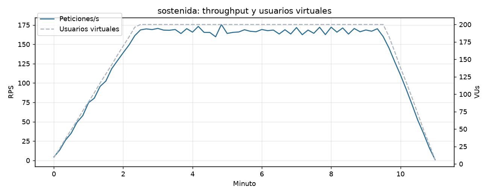
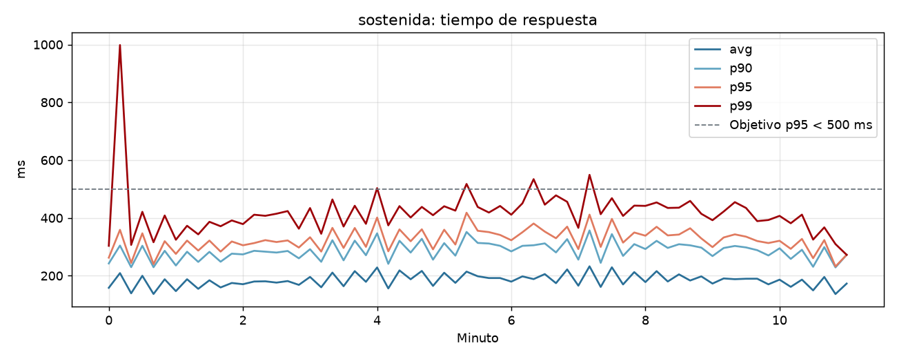
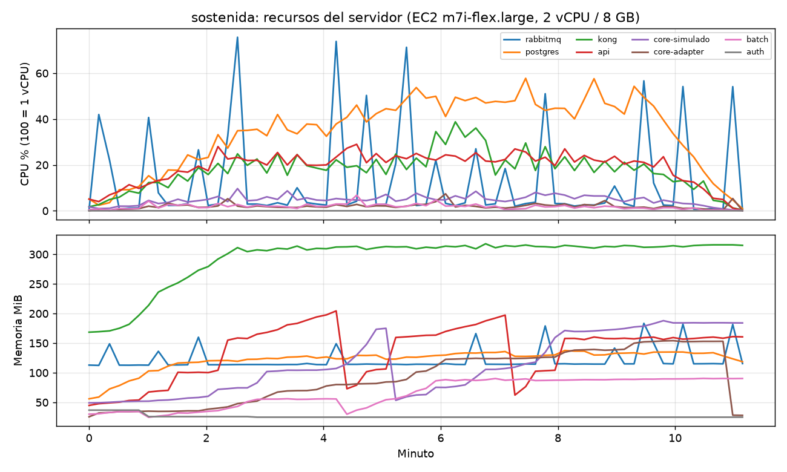
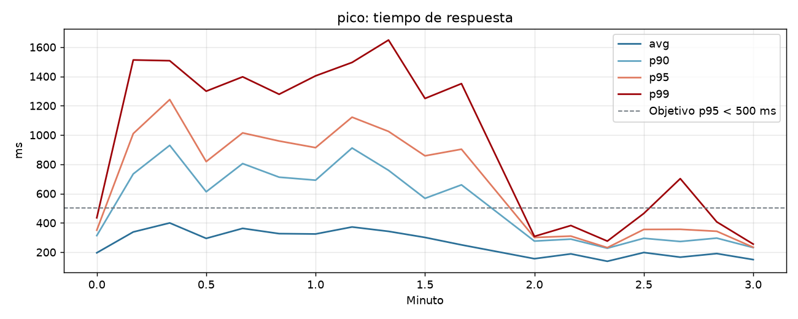
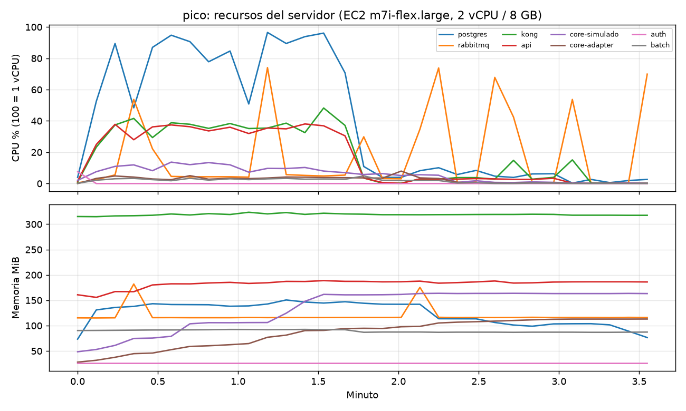
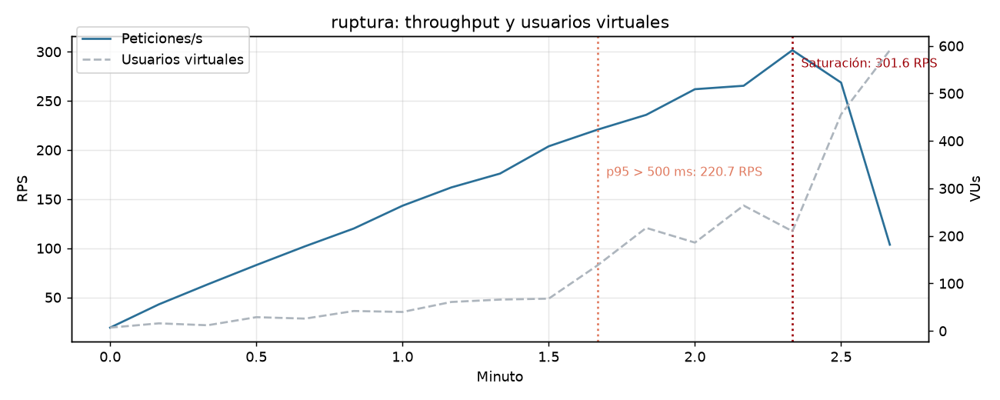
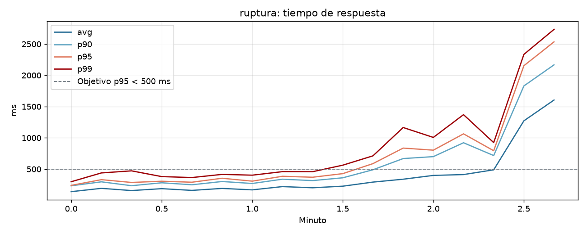
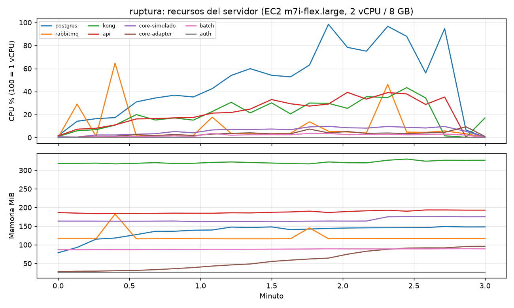

# API de planes de ahorro bancario

**Fase 4: Desarrollo, seguridad y despliegue (RA4)**

Universidad Politécnica Salesiana · Maestría en Software

Asignatura: Patrones de Diseño de APIs

Docente: Ing. Patsy Malena Prieto, MSc.

**Integrantes:**

1. Carlos Adrian Espinoza Alvarez
2. Pablo Jara
3. Miguel Lara
4. Carina Torres
5. Sebastián Uyaguari

Fecha: 5 de octubre de 2026

---

## 1. Introducción

En las fases anteriores definimos el negocio (Fase 1), la arquitectura y los patrones (Fase 2) y el contrato OpenAPI (Fase 3). En esta fase construimos el backend que implementa ese contrato, lo protegimos con JWT, lo probamos con pruebas unitarias, de integración y de carga, y lo desplegamos en AWS con un pipeline de CI/CD.

El código está en la carpeta `backend/` del repositorio, el contrato en `contracts/openapi.yaml` los scripts de carga en `backend/pruebas-carga/` y todas las evidencias en `docs/evidencias/`.

## 2. Implementación del backend

### 2.1 Tecnología y organización por capas

El backend es un solo proyecto en **Node.js con TypeScript** (Express 5, Zod, PostgreSQL 16, RabbitMQ), organizado en cuatro capas cuyas dependencias apuntan hacia el dominio:

| Capa | Carpeta | Contenido |
|---|---|---|
| Dominio | `src/domain` | Reglas puras: tarifas, simulación, estados del plan y de la cuota, estrategias de interés y de salida del bloqueo, eventos |
| Aplicación | `src/application` | Casos de uso (servicios) y puertos: repositorios, unidad de trabajo y `CoreBancarioPort` |
| Infraestructura | `src/infrastructure` | PostgreSQL, RabbitMQ con outbox, Adaptador Core con decoradores, JWT y bcrypt |
| Presentación | `src/presentation` | Express: DTOs con Zod, middlewares, controladores y mappers a la forma del contrato |

*Tabla 1. Capas del backend*

Siguiendo el monolito modular de la Fase 2, el mismo código se ejecuta como cinco procesos, cada uno en su contenedor: Ahorro Core API, Servicio de Autenticación, Batch Processor, Adaptador Core y Core simulado (este último fuera del alcance del producto, sobre MongoDB Atlas).

### 2.2 Patrones de diseño implementados

| Patrón | Implementación |
|---|---|
| Adapter | `CoreLegacyAdapter` (HTTP hacia el Core) y `CoreSimuladoAdapter` (en memoria, para pruebas) implementan `CoreBancarioPort` |
| Decorator | Retry con backoff y jitter → Circuit Breaker (opossum) → Logging → Timeout, compuestos sobre el adaptador. En el camino síncrono no se usa Retry |
| Strategy | `CalculoInteresStrategy` (tasa base o con bono) y `PoliticaSalidaBloqueoStrategy` (pérdida de intereses al desbloquear o cancelar) |
| State | Ciclo de vida del plan (con el bloqueo como sub-estado) y cobro de la cuota (5 intentos a 24 h y prórroga de un mes) |
| Observer | Eventos de dominio publicados en RabbitMQ y consumidos por tipo de evento |
| Transactional Outbox | El evento se guarda en la misma transacción que el cambio y un relay lo publica después del commit |
| Consumidor idempotente y DLQ | Los eventos repetidos se descartan por su id; un mensaje que falla dos veces pasa a una cola `.dlq` |
| Repository y Unit of Work | Puertos en la capa de aplicación, implementados sobre transacciones de PostgreSQL |

*Tabla 2. Patrones implementados*

### 2.3 Manejo de errores y logs

Todos los errores se manejan en un middleware central y salen en formato `application/problem+json` (RFC 9457) con un `codigo` estable, como define el contrato. Cada petición lleva un `X-Request-Id` que se registra en los logs estructurados (pino), junto con el método, la ruta, el código de estado y el tiempo de respuesta. Las llamadas al Core también quedan registradas con su duración y resultado.

## 3. Seguridad

| Mecanismo | Implementación |
|---|---|
| Autenticación | Servicio de Autenticación propio: contraseñas con bcrypt, access token JWT RS256 de 15 minutos y refresh token con rotación (el anterior se invalida) |
| Validación del token | En el API Gateway (Kong, plugin JWT: firma y expiración) y de nuevo en la API (emisor, audiencia y claims), como defensa en profundidad |
| Autorización por rol y scope | Roles CLIENTE, OPERADOR y AUDITOR; cada endpoint exige un scope granular (`planes:leer`, `retiros:escribir`, `corridas:leer`...). Sin el scope, 403 |
| Titularidad (ABAC) | Un cliente solo accede a sus planes; un plan ajeno responde 404 para no revelar que existe |
| Transporte | HTTPS en el Gateway solo con TLS 1.3 (perfil `modern`); una conexión con TLS 1.2 se rechaza |
| Abuso y fuerza bruta | Rate limiting en Kong: 30/min en el login, 600/min en los endpoints públicos y límite general en los autenticados |
| Integridad de operaciones | `Idempotency-Key` en las operaciones que mueven dinero; `ETag`/`If-Match` para modificar planes |
| Auditoría | Ledger de solo inserción: un trigger de PostgreSQL rechaza UPDATE y DELETE |
| Secretos | Claves JWT, contraseñas y la cadena de Atlas cifradas en AWS SSM Parameter Store; nunca en el repositorio ni en la imagen |
| Infraestructura | Sin SSH (puerto 22 cerrado): administración con SSM; el pipeline usa un usuario IAM con permisos mínimos |

*Tabla 3. Mecanismos de seguridad*

## 4. Pruebas unitarias y de integración

Escribimos 97 pruebas con Vitest:

- **84 unitarias** (sin dependencias externas): dominio (estados, estrategias, simulación), servicios sobre repositorios en memoria, decoradores de resiliencia (Retry, Timeout, Circuit Breaker), adaptadores del Core y la API HTTP completa con Supertest y tokens RS256 reales, incluida la publicación de la documentación.
- **13 de integración**: repositorios de PostgreSQL (transacciones, rollback, ledger inmutable, procedimiento del corte diario) y RabbitMQ (enrutamiento por evento y DLQ).

| Métrica | Cobertura |
|---|---:|
| Líneas | 97,95 % |
| Sentencias | 96,57 % |
| Funciones | 97,47 % |
| Ramas | 85,57 % |

*Tabla 4. Cobertura de código (umbral configurado: 80 %)*

Se excluyen de la medición los puntos de entrada de los procesos, verificados con el despliegue, y el Core simulado, que está fuera del alcance. El reporte HTML de cobertura queda como artefacto en cada ejecución del pipeline.

## 5. Despliegue y CI/CD

### 5.1 Infraestructura en AWS

La cuenta del proyecto solo permite la región **us-east-2 (Ohio)** y tipos de instancia de la capa gratuita.

| Recurso | Uso |
|---|---|
| EC2 `m7i-flex.large` (2 vCPU, 8 GB), Ubuntu 24.04 | Ejecuta los 8 contenedores con Docker Compose |
| Elastic IP 3.151.57.252 | URL pública fija de la API |
| Grupo de seguridad | Solo puertos 80 y 443 hacia Kong |
| ECR | Repositorio de imágenes de Docker |
| SSM Parameter Store | Secretos cifrados |
| MongoDB Atlas | Base del Core bancario simulado |

*Tabla 5. Recursos en AWS*

La instancia se mantiene apagada fuera de las pruebas para no generar costos, y se enciende desde GitHub Actions cuando hace falta.

### 5.2 Pipeline de CI/CD

El workflow `.github/workflows/backend-ci-cd.yml` se ejecuta en cada push a `main`:

1. **Pruebas y contrato:** verificación de tipos, lint del contrato OpenAPI y las 97 pruebas con cobertura, usando PostgreSQL y RabbitMQ como servicios del runner.
2. **Imagen en ECR:** construye la imagen `linux/amd64` y la publica con el SHA del commit.
3. **Despliegue en EC2:** por SSM Run Command la instancia descarga la imagen, extrae de ella los archivos de despliegue, lee los secretos de SSM, levanta los contenedores y verifica la API. Termina con una prueba pública. Si la instancia está apagada, la imagen queda publicada y el despliegue se omite.

Un segundo workflow, `aws-instancia.yml`, enciende, apaga o consulta la instancia.

La documentación del contrato se publica junto con la API: Swagger UI en `http://3.151.57.252/docs/` y el archivo en `/docs/openapi.yaml`.

## 6. Pruebas de carga y estrés (k6)

### 6.1 Entorno y metodología

- **Generador de carga:** k6 2.3 desde un equipo en Ecuador, a través de Internet hacia la API en Ohio. Cada medición incluye la latencia de red de ida y vuelta (unos 100 ms, el mínimo observado), así que los tiempos son los que percibe un cliente real.
- **Sistema bajo prueba:** el despliegue de producción descrito en la sección 5, a través de Kong.
- **Mezcla de tráfico** de un cliente autenticado: listado de planes (30 %), detalle (20 %), movimientos con cursor (18 %), cuotas (12 %), cuentas en el Core por el camino síncrono hacia MongoDB Atlas (12 %) y aportes (8 %), con 0,5 a 1,5 s de pausa entre operaciones.
- **Recursos del servidor:** se registraron CPU y memoria de cada contenedor durante cada prueba.
- **Scripts y resultados:** `backend/pruebas-carga/` contiene los scripts y el analizador (`analizar.py`); las gráficas, los dashboards HTML de k6 y las métricas están en `docs/evidencias/fase-4-carga/`.

Antes de las pruebas, una medición inicial mostró que listar las cuentas tardaba 255 ms dentro del servidor, porque el Core simulado hacía dos consultas seguidas a Atlas. Las unimos en una sola consulta con `$lookup` y el tiempo bajó a unos 133 ms.

### 6.2 Escenario 1: carga sostenida

Subida de 0 a 200 usuarios virtuales en 2,5 min, meseta de 7 min y bajada en 1,5 min.

| KPI | Resultado | Objetivo |
|---|---:|---:|
| Peticiones totales | 90 815 | — |
| Throughput en la meseta | **167 RPS** | — |
| Tiempo promedio | 188 ms | — |
| Mediana | 170 ms | — |
| p90 | 296 ms | — |
| **p95** | **336 ms** | < 500 ms ✅ |
| p99 | 436 ms | — |
| **Tasa de error** | **0,001 %** (1 respuesta 502 de 90 815) | < 1 % ✅ |

*Tabla 6. KPIs de la carga sostenida*

| Endpoint | Peticiones | Promedio (ms) | p90 | p95 | p99 | Error % |
|---|---:|---:|---:|---:|---:|---:|
| `GET /v1/planes-ahorro` | 27 258 | 178 | 272 | 306 | 399 | 0,00 |
| `GET /v1/planes-ahorro/{id}` | 18 172 | 163 | 250 | 278 | 338 | 0,00 |
| `GET .../movimientos` | 16 391 | 172 | 263 | 295 | 389 | 0,00 |
| `GET .../cuotas` | 11 118 | 171 | 264 | 300 | 396 | 0,00 |
| `GET /v1/cuentas-debito` | 10 757 | 298 | 394 | 431 | 480 | 0,00 |
| `POST .../aportes` | 7 108 | 184 | 289 | 333 | 462 | 0,01 |

*Tabla 7. Tiempos por endpoint en la carga sostenida*

*Ilustración 1. Carga sostenida: throughput y usuarios virtuales*

*Ilustración 2. Carga sostenida: tiempo de respuesta (promedio y percentiles)*

*Ilustración 3. Carga sostenida: CPU y memoria por contenedor*

**Análisis.** La API se mantuvo estable durante toda la meseta, con el p95 entre 300 y 420 ms, y cumplió los dos umbrales de la rúbrica. El endpoint más lento es el que consulta el Core por el camino síncrono (p95 de 431 ms), porque incluye la ida a MongoDB Atlas; aun así quedó bajo el objetivo. Los recursos quedaron holgados: PostgreSQL promedió 34 % de una vCPU y la API 19 %, con picos de memoria de 318 MiB en Kong y 204 MiB en la API. Hubo una sola respuesta 502 aislada en toda la prueba (0,001 %).

### 6.3 Escenario 2: pico extremo

De 0 a 500 usuarios virtuales en 10 s (450 clientes autenticados y 50 visitantes anónimos que simulan sin pausa), 1,5 min de pico, caída inmediata y 1 min de recuperación con 20 usuarios.

| Grupo | Peticiones | RPS | Promedio | p95 | p99 | Errores |
|---|---:|---:|---:|---:|---:|---:|
| Clientes durante el pico | 28 558 | 272 | 544 ms | 1 249 ms | 1 525 ms | **0,00 %** |
| Anónimos en `/v1/simulaciones` | 33 421 | 321 | 145 ms | 216 ms | 283 ms | 96,3 % (429, rate limiting) |
| Recuperación | 1 034 | 17 | 172 ms | **307 ms** | 453 ms | **0,00 %** |

*Tabla 8. KPIs de la prueba de pico*

*Ilustración 4. Pico: tiempo de respuesta (incluye el tráfico anónimo)*

*Ilustración 5. Pico: CPU y memoria por contenedor*

**Análisis.**

- **Sin errores bajo el pico:** con 450 clientes simultáneos (más del doble de la meseta de la carga sostenida y 22 veces la carga de recuperación), la API no devolvió errores. La latencia subió (p95 de 1,25 s) porque PostgreSQL llegó al 96,5 % de CPU, pero ninguna petición se perdió.
- **Rate limiting:** los visitantes anónimos superaron el límite de 600 peticiones por minuto por IP y Kong respondió 429 con `Retry-After` al 96 % de ellas, sin que esa carga llegara a la API. Las simulaciones que sí pasaron se sirvieron desde la caché del Gateway (145 ms en promedio).
- **Recuperación automática:** al terminar el pico, el sistema volvió solo a su comportamiento normal (p95 de 307 ms, 0 % de errores), sin reinicios ni caídas en cascada.

### 6.4 Escenario 3: punto de ruptura

La tasa de llegada sube de forma continua de 20 a 1 200 peticiones por segundo, sin pausas. La prueba se detiene sola cuando el p95 supera 1,5 s o los errores pasan del 5 %.

| Momento | RPS | Peticiones en curso | p95 | Errores |
|---|---:|---:|---:|---:|
| Funcionamiento normal | 144 | 40 | 307 ms | 0 % |
| Último punto dentro del objetivo | 204 | 68 | 428 ms | 0 % |
| **Degradación** (p95 > 500 ms sostenido) | **221** | 138 | 588 ms | 0 % |
| **Saturación** (máximo throughput) | **302** | 210 | 794 ms | 0 % |
| Corte de la prueba | 269 | 456 | 2 153 ms | 0 % |

*Tabla 9. Evolución hacia el punto de ruptura*

*Ilustración 6. Ruptura: throughput, usuarios y puntos de degradación y saturación*

*Ilustración 7. Ruptura: tiempo de respuesta*

*Ilustración 8. Ruptura: CPU y memoria por contenedor*

**Análisis.** Con el despliegue actual en una sola instancia de 2 vCPU:

- **Punto de ruptura: ~220 RPS** (unas 140 peticiones simultáneas). Desde ahí el p95 deja de cumplir los 500 ms.
- **Capacidad máxima: ~300 RPS.** Más allá, el throughput ya no crece: la cola de peticiones aumenta y la latencia sube de forma exponencial, hasta un p95 de 2,1 s.
- **Cuello de botella:** PostgreSQL llegó al 98,5 % de CPU en el mismo momento, mientras la API (39 % máximo) y Kong (43 %) seguían con margen.
- **Degradación sin fallos:** aun saturado, el sistema casi no devolvió errores (0,018 %). Se degrada por latencia, no por fallos, lo que es preferible porque los reintentos del cliente no empeoran la situación.

### 6.5 Conclusiones y mejoras propuestas

1. **Cumplimiento:** la API cumple los objetivos de la rúbrica bajo la carga sostenida esperada (p95 de 336 ms con 200 usuarios, error de 0,001 %) y tiene un margen de capacidad de ~30 % antes del punto de ruptura.
2. **Resiliencia demostrada:** rate limiting, caché del Gateway y recuperación sin intervención después de un pico de 500 usuarios simultáneos.
3. **Mejora para escalar:** el factor limitante es el cálculo de saldos en PostgreSQL. La vista `vw_planes` suma el ledger completo de cada plan en cada lectura, y ese costo crece con los movimientos. Proponemos mantener una tabla de saldos actualizada en la misma transacción que cada asiento, sin dejar de derivar del ledger, y escalar PostgreSQL a una instancia administrada (RDS). Con eso el siguiente límite pasaría a ser la API, que sí se puede replicar horizontalmente detrás de Kong (RNF-01.3).

## 7. Evidencias

| Carpeta | Contenido |
|---|---|
| `docs/evidencias/fase-3-contrato/` | Validación del contrato con Redocly y capturas de Swagger UI publicado |
| `docs/evidencias/fase-4-pruebas/` | Salida de las 97 pruebas, resumen de cobertura y reporte HTML |
| `docs/evidencias/fase-4-seguridad/` | 18 verificaciones contra la API desplegada: 401, 403, 404, 400, idempotencia, 409, 412, 202, rotación del refresh token, TLS 1.3 y 429 |
| `docs/evidencias/fase-4-despliegue/` | Recursos en AWS, contenedores en la instancia y ejecución del pipeline |
| `docs/evidencias/fase-4-carga/` | Resultados de k6, gráficas, dashboards HTML y métricas del servidor |

*Tabla 10. Evidencias*

## 8. Referencias

- Grafana Labs. (2026). *k6 documentation*. https://grafana.com/docs/k6/
- Internet Engineering Task Force. (2023). *RFC 9457: Problem Details for HTTP APIs*.
- Jones, M., Bradley, J., & Sakimura, N. (2015). *JSON Web Token (JWT)*. RFC 7519. Internet Engineering Task Force.
- Nygard, M. T. (2018). *Release It! Design and deploy production-ready software* (2.ª ed.). Pragmatic Bookshelf.
- Prieto, P. M. (2026). *Unidad 4: Desarrollo de sistemas basados en APIs* [Material de clase]. Maestría en Software, Universidad Politécnica Salesiana.
- Richardson, C. (2018). *Microservices patterns*. Manning.
